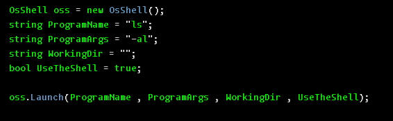

# WHAT THE HECKS IS THIS 
A wrapper to the System.Diagnostics.Process Class for dotnet like development Kits like .NET,monoSDK

# WHY IS THIS
Because there is no official Classes to access the shell of the Operating System in the target platforms of dotnet(and dotnet like development kits) , through this Library you perform shell operations using the System.Diagnostics.Process Class and its dependencies.

# USAGE 
1. Pick the Oscs.cs file and Copy it to your project directory. 
2. Dont Forget to add the Oscs.cs file during your compilation incase you use it in your project.
3. To launch a process / program from the shell of the os , You have to instantiate OsShell class found in the Oscs namespace. 

    <code>Oscs.OsShell osShell = new Oscs.OsShell();</code>
4. Call the OsShell.Launch() method on the OsShell object 

# SCREEN SHOTS

